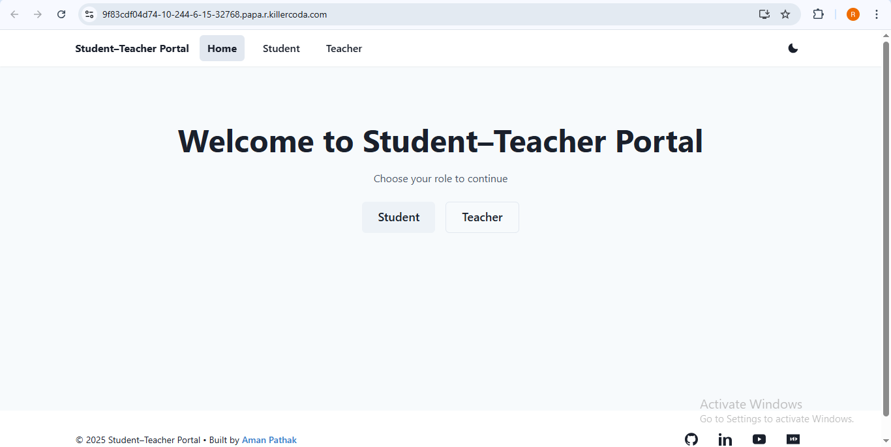
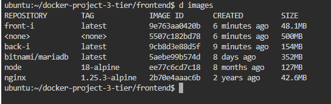
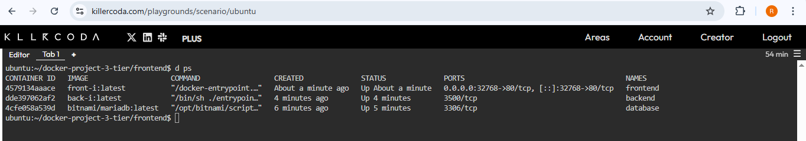
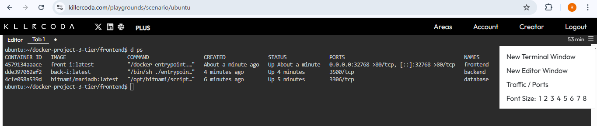
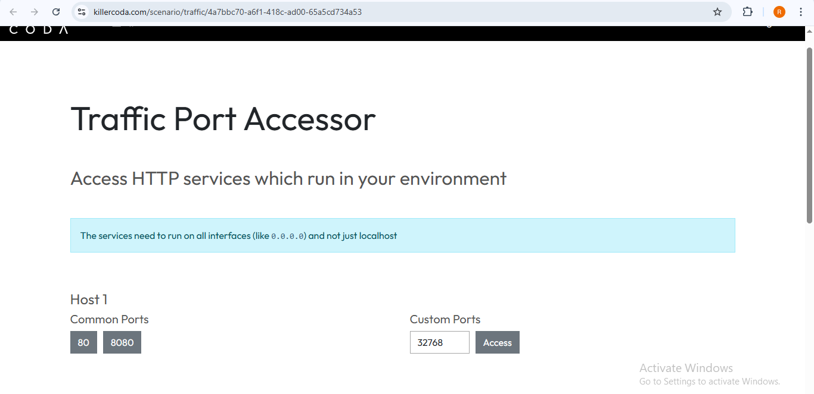
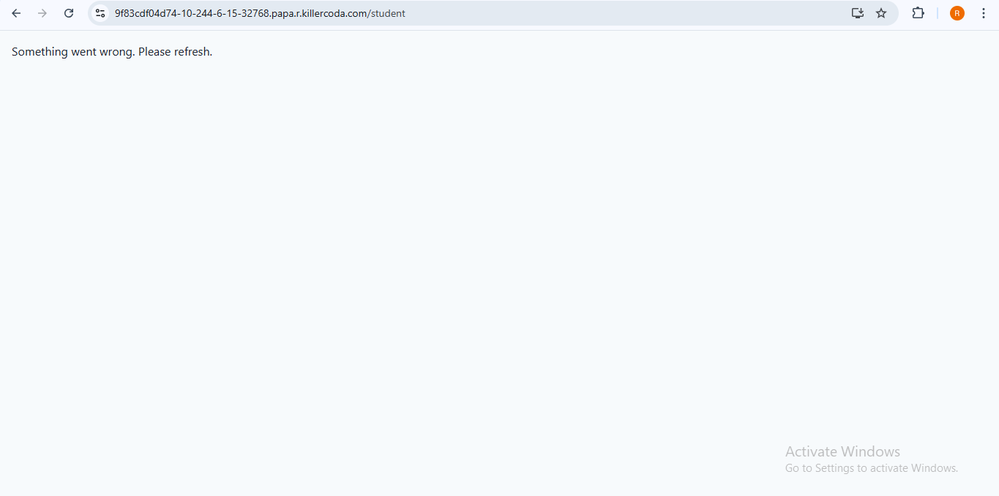
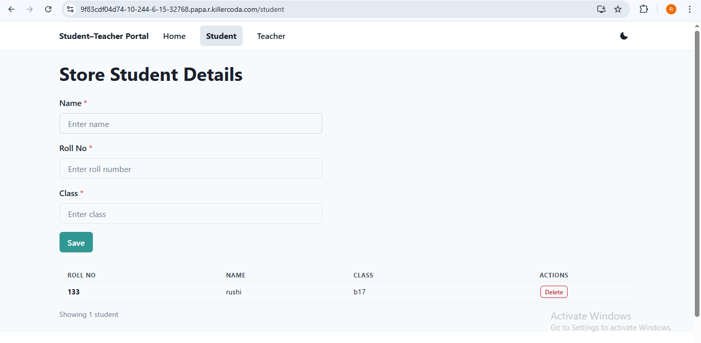

## How to run this project

search "killercoda ubuntu playground" on google
open ubuntu playground, now we run this project here
you can run this anywhere but I do it with killercoda

first make sure docker and git installed or not
```bash
docker -v
git -v
```
if not, then installed with 
`sudo apt update && sudo apt upgrade && sudo apt install docker -y`

then set alias for docker command which makes our life easy
```bash
alias "d=docker"
source .bashrc 
```
source .bashrc needed for refresh file so our alias d (docker) starts working

For any 3 tier project we always need network and volume, user defined network required so containers can talk to each other directly using container names so we don't need to open any hostPort and volume is require for data persistence
so we start by creating network and volume first
type this 2 commands
```bash
d network create mynet
d volume create myvol
```

for this full stack application we need 3 containers: frontend, backend, database. 
in this application devoloper uses mysql.
now we start creating containers, first we create database container because it don't need any code
```bash
d run -d --name=database --network=mynet -v myvol:/bitnami/mariadb -e MARIADB_ROOT_PASSWORD=mypass bitnami/mariadb:latest
```
it also creates "test" database by default
here we uses bitnami/mariadb base image which size after pulling is 352MB which works for any mysql application.
then we run our remaining containers, but we need code
```bash
git clone https://github.com/rushitest4559/docker-project-3-tier.git
```
go inside backend folder
```bash
cd docker-project-3-tier
cd backend
```
create backend image 
```bash
d build -t back-i:latest .
```
now our backend image is ready, which size is 154MB on host, we start container from this image
our backend container needs 4 env variables which should be passed when creating a container, this is not good way to pass environment variables, we should use some secrets management and credentials management service but for now this ok, if we don't pass this env variables container won't start and you will see error in d logs backend.
we don't need to port mappings because our all containers are in same network so they can communicate with each other directly with container names
```bash
d run -d --name=backend --network=mynet -e host=database -e user=root -e password=mypass -e database=test back-i:latest
```
verify if it is running or not, if not running then check logs
```bash
d ps
d logs backend
```

if this container starts perfectly go to frontend folder
```bash
cd ../frontend
```
build docker image for frontend
```bash
d build -t front-i:latest .
```
it may take some more time, if anyone have idea to reduce the build time for this image then you can pull request.
we build this frontend image in 2 stage builds so final image size is 48.1MB on host
now we can create container for frontend
```bash
d run -d --name=frontend --network=mynet -P front-i:latest
```
verify if it is running or not, if not running then check logs
```bash
d ps
d logs frontend
```
now you should see all 3 containers are running successfully and we open hostPort and do port binding only for frontend container because we uses nginx proxy in frontend to send /api requests to backend container and / requests to frontend container. so we don't make our backend container public, all requests first come to frontend container then if this requests come from / path then nginx sends /usr/share/nginx/html as response and if requests come from /api/ then nginx sends this request to backend container internally.




now click the menu button at top right corner of killercoda website inside ubuntu playground and click Traffic/Ports, enter hostPort (external) port of frontend container in custom ports and click Access and now you can see our website in browser successfully, you could go to teacher or student page and try adding data.





In this project we used persistent volumes from host so even if database container deleted and we started new container then also our data will be persisted.
so after adding some data from website, delete the database container.
```bash
d rm -f database
```
then go to our webpage and go to home page then again goto teacher or student page. you should see error now.



and start it again
```bash
d run -d --name=database --network=mynet -v myvol:/bitnami/mariadb -e MARIADB_ROOT_PASSWORD=mypass bitnami/mariadb:latest
```
and again go to website, go to main domain(remove all routes, means go to home page) and you could see our data we added previously with old database container. so our data is persisted outside container.




**_[docker files explaination](docs/doc1.md)_**
**_[communication between containers](docs/doc2.md)_**
**_[traffic flow from client to data](docs/doc3.md)_**
