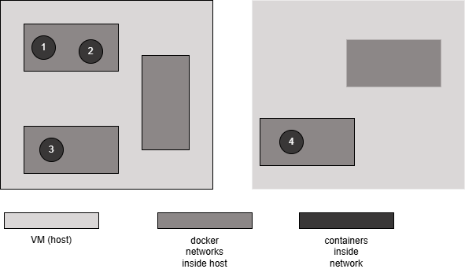

## Communication between containers ##  

  

From this image we consider 2 host mahines (VMs on cloud), we have 3 networks on host1 and 2 networks in host2.
we have total 4 containers in this 2 host machines.  

1. How container-1 and container-2 talk to each other?  
because this 2 containers are in same network we don't need port binding with -p or -P options, and don't need to open any port. This 2 containers talk to each other directly using container names without any port binding to hostPort, only containerPort is enough which is given automatically by application itself.

2. How container-1 and container-3 talk to each other?
In this case we need to port binding of containerPort with hostPort because they are in differrent networks now but on same host, so they talk to each other like: if container-1 hostPort is 32770 and container-2 hostPort is 32771, then container-1 talk to container-2 using *localhost:32771*. They can't communicate directly with container names.

3. How container-1 and container-4 talk to each other?
In this case obviously we need to do port binding to hostPort, and they talk to each other using host IP address (public ip if this 2 hosts are in different network or private ip if both hosts are in same network) like *<public or private ip>:<hostPort>*